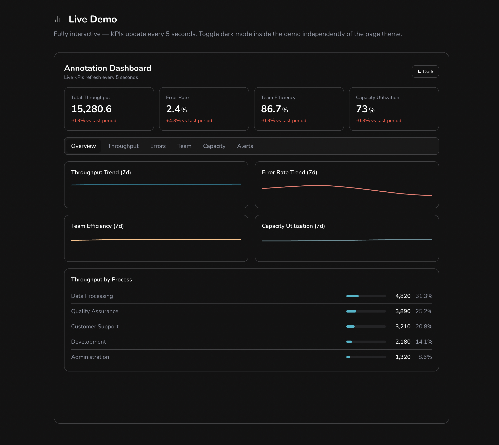
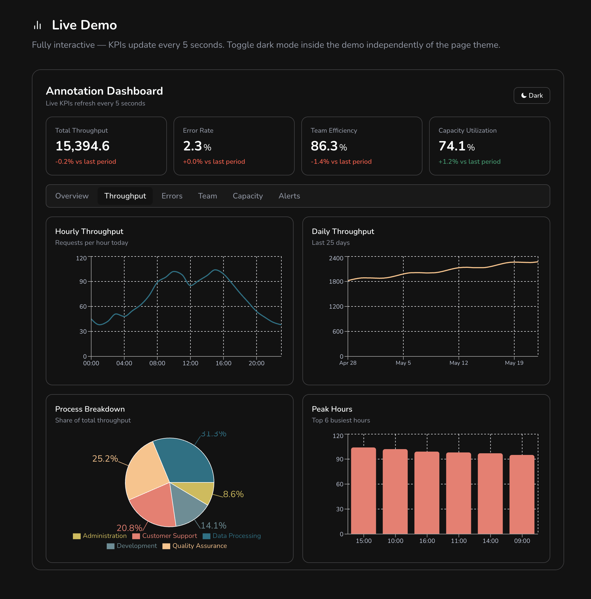
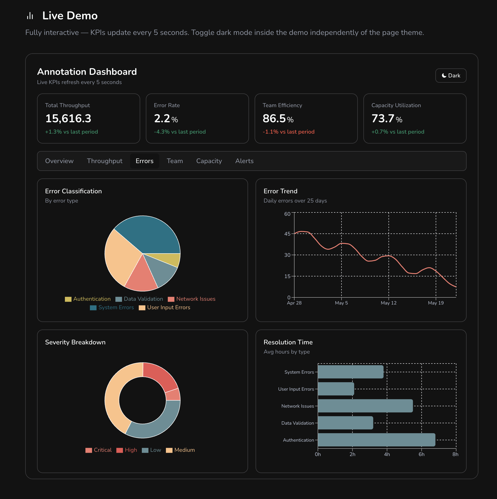
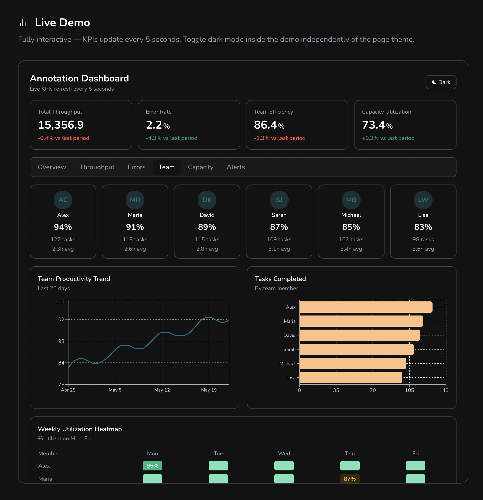
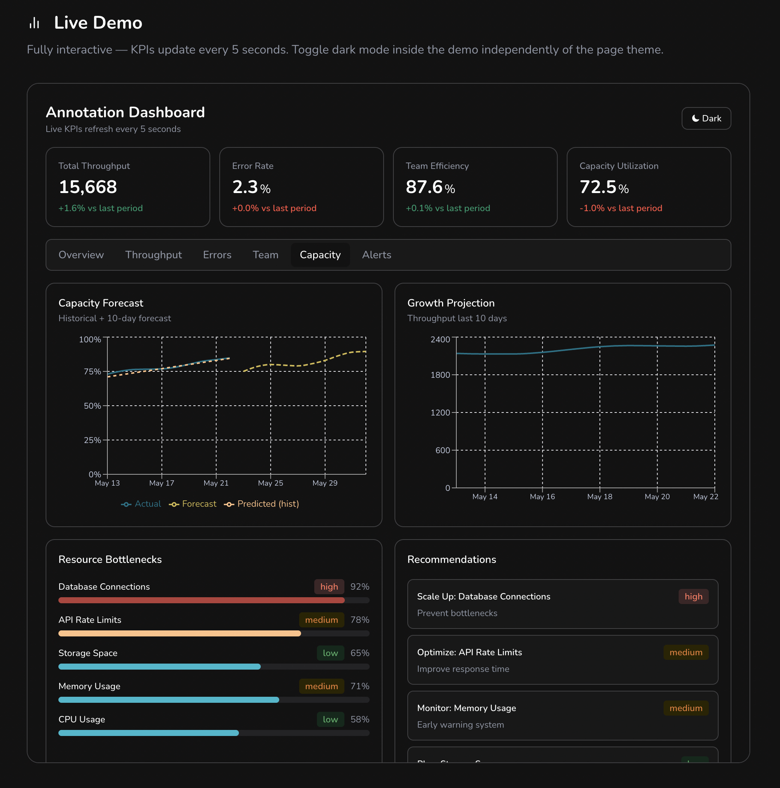
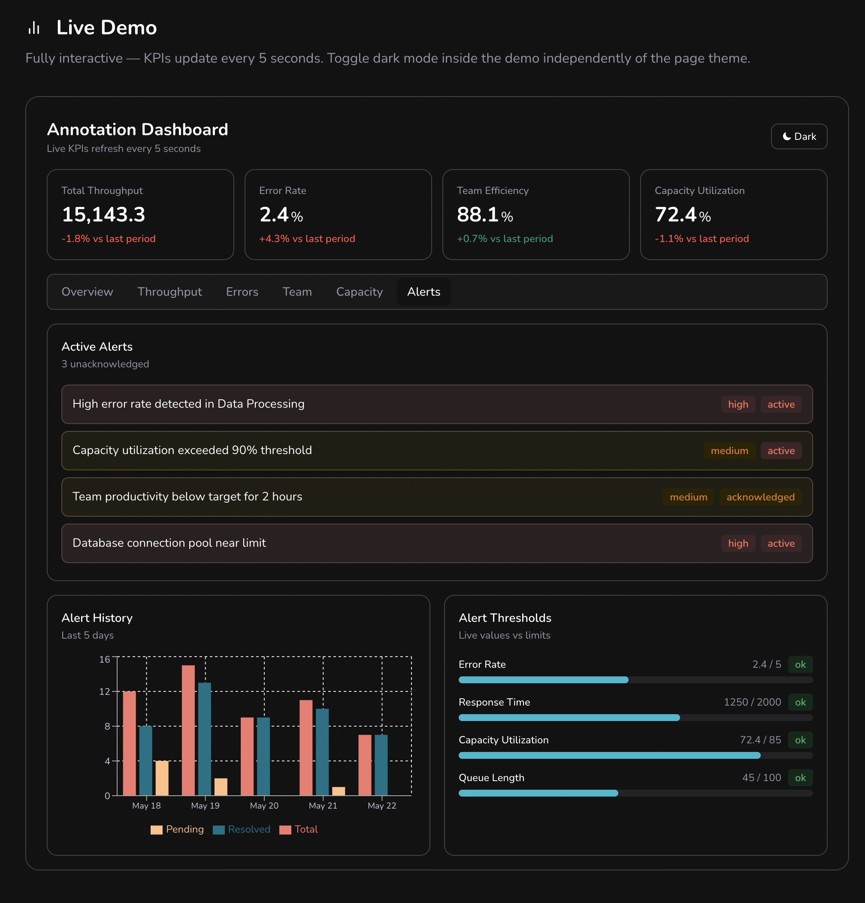

# Annotation Analytics Dashboard (formerly Performance Analytics Tool)

**Annotation Analytics Dashboard** is an interactive real-time dashboard for tracking ML data operations metrics — including annotation quality trends, pipeline throughput, team efficiency, and capacity utilization — with live state updates every 5 seconds.

> **📝 Note:** This project was previously named **"Performance Analytics Tool"** and built with HTML/CSS/JavaScript. It has been fully rebuilt in **Next.js 14** with TypeScript and Recharts for improved real-time capabilities and accessibility.

## Features

- **Live KPI Metrics:** Four real-time KPI cards (throughput, error rate, team efficiency, capacity utilization) update every 5 seconds with independent ±2.5% variation per metric
- **Alert Threshold Engine:** Alert thresholds sync live to KPI values each tick, automatically flagging warning states when error rate or capacity cross configured limits
- **Team Performance View:** Per-member productivity cards, task completion bar charts, and a weekly utilization heatmap with low/medium/high classification
- **Capacity Forecasting:** Historical vs. predicted capacity trend chart with forward-looking forecast bands to surface resource bottlenecks before they occur
- **Multi-tab Analytics:** Overview, Throughput, Errors, Team Performance, Capacity Forecasting, and Alerts tabs for comprehensive workflow visibility
- **Dark/Light Theme:** Toggle between themes with instant transition
- **Accessible Design:** ARIA-labeled tab navigation, responsive layout, keyboard navigation support

## Tech Stack

- **Framework:** Next.js 14, TypeScript
- **Visualization:** Recharts
- **Styling:** Tailwind CSS
- **Animation:** Framer Motion
- **State Management:** React Hooks, custom `useLiveKpis` hook
- **Previous Version:** HTML, CSS, JavaScript (Chart.js) — now rebuilt

## Key Metrics Tracked

| Metric | Base Value | Trend |
|--------|-----------|-------|
| Total Throughput | 15,420 | +8.5% |
| Error Rate | 2.3% | -15.2% |
| Team Efficiency | 87.5% | +5.1% |
| Capacity Utilization | 73.2% | +2.8% |

## Relevance to ML Data Operations

This dashboard simulates the operational visibility used in **ML data operations** roles, demonstrating:

- Pipeline throughput tracking and trend analysis
- Annotation error rate monitoring with classification
- Team productivity and utilization heatmaps
- Capacity forecasting to identify resource bottlenecks
- Real-time alert threshold monitoring

Ideal for showcasing skills in **Data Operations**, **ML/AI Data Specialist**, and **Technical Support Engineer** positions.

## Live Demo

View the interactive dashboard on my portfolio: [zrl.dev](https://zrl.dev) → Projects → Annotation Analytics Dashboard

## Stability & Code Quality

Key implementation improvements:

- **Independent metric variation** — ±2.5% variation per metric with no correlated ticks
- **Live trend badge re-rendering** — Text re-renders each interval
- **Error rate precision** — Preserved to 2 decimal places
- **Inverted color logic** — Lower error rate = green (correct semantics)
- **Alert threshold wiring** — Current values sync to live KPIs
- **Chart.js pinned** — Version 4.4.4 with SRI integrity hash
- **Null-guarded tab listeners** — Loop with `if(btn)` check prevents crashes
- **Error boundary** — `loadOverviewTab` wrapped in `tryLoadTab`
- **Theme flash prevention** — Inline script prevents light-mode flash on load
- **Full ARIA accessibility** — All tabpanels properly labelled

## Usage

1. Visit [zrl.dev](https://zrl.dev) to see the live demo.
2. Navigate to Projects → Annotation Analytics Dashboard.
3. Explore live KPI updates every 5 seconds with dark/light theme toggle.
4. Click through tabs: Overview, Throughput, Errors, Team, Capacity, Alerts.

## Screenshots

📸 <strong>View all screenshots (5)</strong>

 

<table>
  <tr>
    <td></td>
    <td></td>
  </tr>
  <tr>
    <td></td>
    <td></td>
  </tr>
  <tr>
    <td></td>
  </tr>
</table>

## License

MIT License © 2025 Zachary Ryan Lopez.   
See `LICENSE` for details.

---

**Portfolio:** [zrl.dev](https://zrl.dev) | **GitHub:** [@zrlopez](https://github.com/zrlopez)
